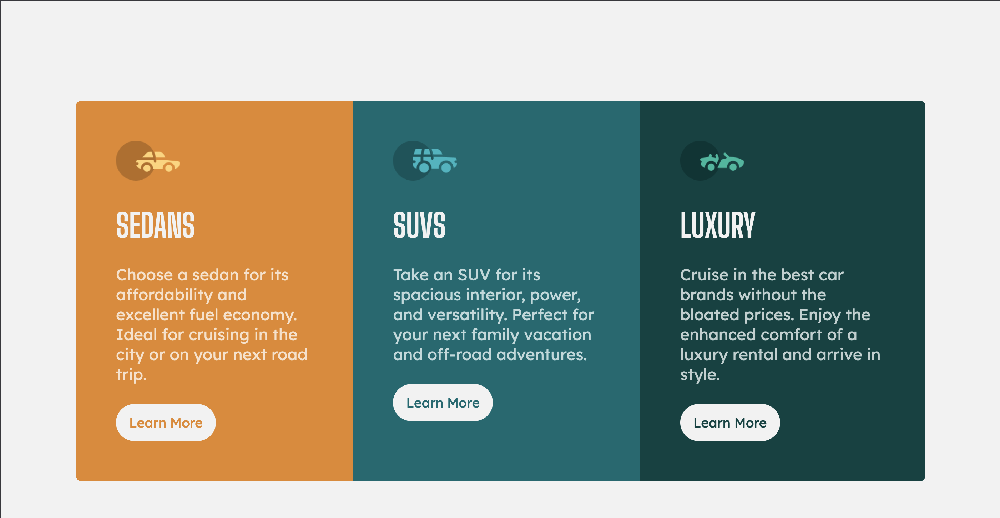

# Frontend Mentor - 3-column preview card component solution

This is a solution to the [3-column preview card component challenge on Frontend Mentor](https://www.frontendmentor.io/challenges/3column-preview-card-component-pH92eAR2-). Frontend Mentor challenges help you improve your coding skills by building realistic projects. 

## Table of contents

- [Overview](#overview)
  - [Screenshot](#screenshot)
  - [Links](#links)
  - [Built with](#built-with)
  - [Continued development](#continued-development)
  - [Author](#author)
  - [Acknowledgments](#acknowledgments)

## Overview

### Screenshot

### Links

- Live Site URL: [Add live site URL here](https://davidalex17.github.io/3-column-preview-card-component-main/)

### Built with

- Semantic HTML5 markup
- CSS custom properties
- Flexbox
- Mobile-first workflow

### Continued development

i believe i did pretty well simplifying the pseudo element for the certain cases i need. Even though it was not much it was was more first time working with pseudo css. i see the scope of using it now, especially for large scale projects. i will definitely continue improving on advanced css elements. 

A hard tackle was mostly dealing with styling the child elements inside the li. Trying to keep them precisely at a certain width with a certain pixel dimensions was difficult. I will have to work on that.

another advanced css topic i would like to add is media queries, i believe im getting the hang of it although i still to learn a lot more patterns to fully untie the nots when trying to make it responsive. Consistency, consistency, consistency!

## Author

- Frontend Mentor - [DavidAlex17](https://www.frontendmentor.io/profile/DavidAlex17)

## Acknowledgments

i want to give a shout out to my past front-end mentor challenges by learning from similar past mistakes, which inevitably lead me to improving my code a tiny bit.